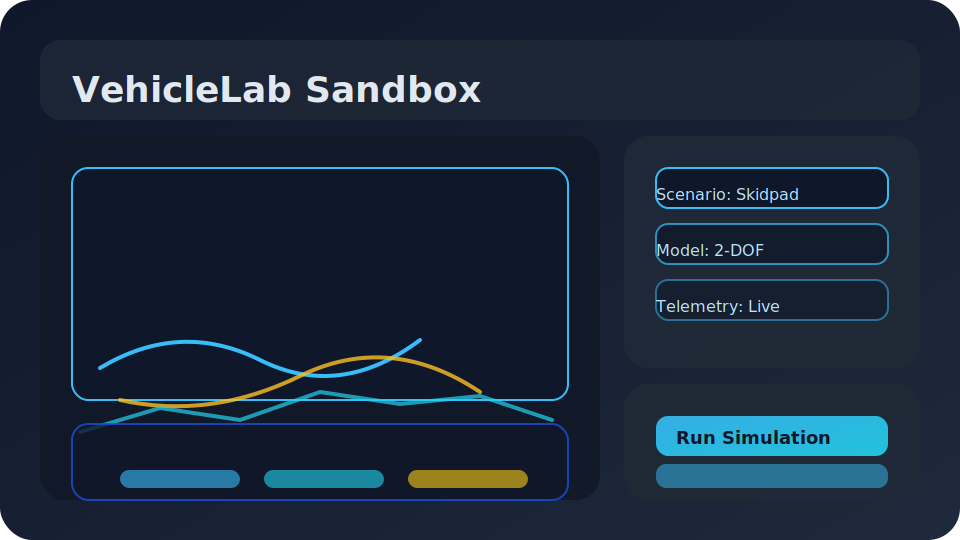
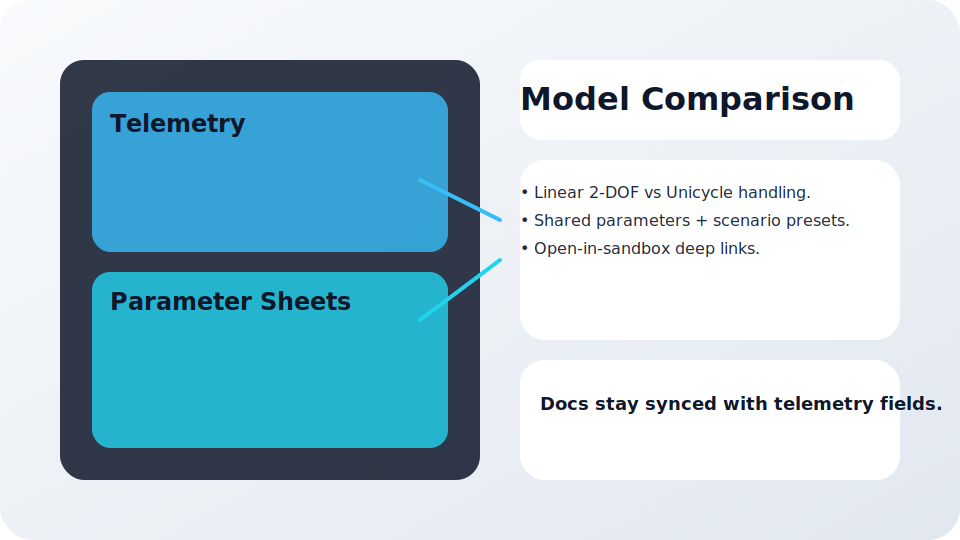

# VehicleLab

> Browser-native vehicle dynamics sandbox for fast iteration and telemetry-driven exploration.


## Highlights
- Canvas-first sandbox with shareable presets, live telemetry, and exportable CSV/PNG artifacts.
- Linear 2-DOF and unicycle models with per-scenario docs and deep links straight into the sandbox.
- Local-first setup: SQLite, Prisma, and Contentlayer run without external services.
- Optional three.js viewer and validation badges keep heavy features gated by configuration.

## Quickstart

### Requirements
- Node.js 22.x (`.nvmrc` pins 22.9.0).
- npm 10 (ships with Node 22).
- SQLite (bundled; Prisma downloads the native binary on first install).

### Setup
```bash
nvm use
npm install
cp .env.example .env.local
npm run db:setup
npm run dev
```
Open http://localhost:3000 and use **Call /api/ping** to smoke-test the API.

### Common scripts
- `npm run build` — Production build of the Next.js app.
- `npm run start` — Serve the build locally.
- `npm run lint` / `npm run typecheck` — Static analysis from the web workspace.
- `npm run test` — Playwright end-to-end tests (requires installed browsers).
- `npm run content` — Regenerate Contentlayer output.

## Screenshots



## Docs & Workflows
- `/docs/models` — Model catalogue with parameter sheets and Open in Sandbox shortcuts.
- `/docs/models/comparison` — Side-by-side comparison of available models and their recommended scenarios.
- `/sim` — Canvas-first sandbox with shareable query string presets.
- `/vehicellab` — Marketing page outlining capabilities for stakeholders.

## Deployment Notes
- `.nvmrc` pins Node 22.9.0; deploy targets should match to keep Prisma binaries compatible.
- `vercel.json` ships with a minimal config (edge-disabled, analytics opt-out) so the project can be dropped onto Vercel as-is.
- Environment variables live in `.env.local`; copy from `.env.example`. NextAuth, payments, and analytics stay disabled unless you provide credentials.
- 3D rendering and validation badges are controlled through `apps/web/content/profile.json` so you can tailor heavier features per environment.

## Repository Layout
```
vehiclelab/
├─ apps/
│  └─ web/          # Next.js app (App Router, Prisma, Contentlayer, workers)
├─ docs/            # Reference docs, screenshots, deployment notes
├─ .env.example     # Template for .env.local
├─ .nvmrc           # Node version pin (22.9.0)
└─ package.json     # npm workspace entry point
```

## Troubleshooting
- **npm registry hiccups (403):** `npm config set registry https://registry.npmjs.org/ && npm cache clean --force`
- **Contentlayer output missing:** Run `npm run content` or simply rerun `npm run dev` to regenerate caches.
- **Reset the SQLite db:** Remove `apps/web/data/app.db` and rerun `npm run db:setup`.
- **Windows shell quirks:** Git Bash or WSL is recommended; Command Prompt may ignore some scripts.

See `docs/AUDIT.md` for deeper notes on local-first auth, Prisma, and validation coverage.
