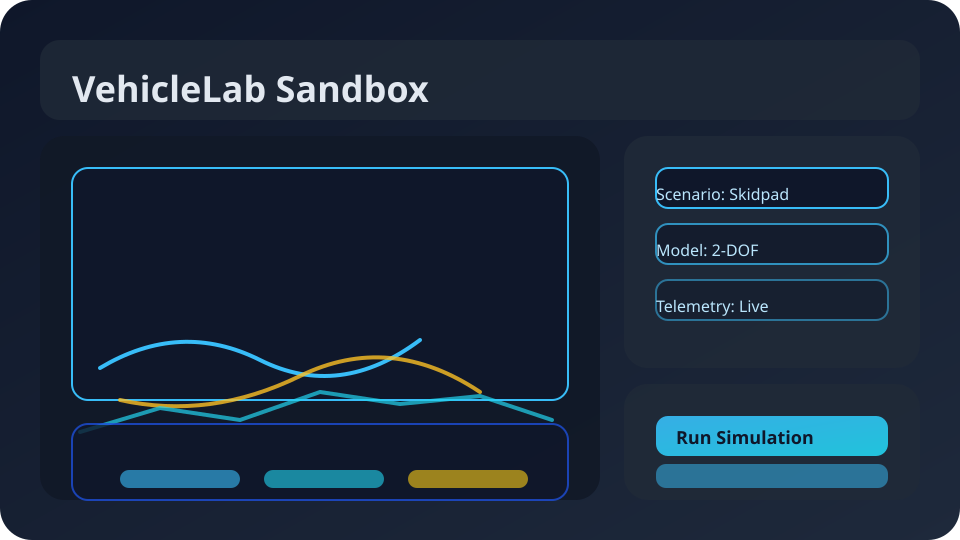

# VehicleLab

VehicleLab is a browser-based vehicle dynamics sandbox with presets, telemetry, and shareable deep links.


[Open Sandbox](/sim) | [Model Docs](/docs/models)

## Quickstart

### Requirements
- Node.js 22.x recommended (`.nvmrc` pins 22.9.0)
- npm 10 or a compatible npm version
- SQLite (bundled; Prisma downloads the native binary on first install)
- Windows PowerShell users may need `npm.cmd` instead of `npm` if `npm.ps1` is blocked by execution policy.

### Setup
```powershell
nvm use 22.9.0
npm.cmd ci
Copy-Item .env.example .env.local
npm.cmd run db:setup
npm.cmd run dev
```
Use `npm.cmd install` only when `npm.cmd ci` is not appropriate, such as after intentionally changing dependencies.

Open http://localhost:3000 and use **Call /api/ping** to smoke-test the API.

### Local app routes
- http://localhost:3000
- http://localhost:3000/sim
- http://localhost:3000/docs/models
- http://localhost:3000/docs/tests
- http://localhost:3000/vehicellab
- http://localhost:3000/api/ping

### Common scripts
- `npm.cmd run dev` - Start the Next.js dev server
- `npm.cmd run build` - Production build of the Next.js app
- `npm.cmd run start` - Serve the production build locally
- `npm.cmd run lint` - ESLint for the web workspace
- `npm.cmd run typecheck` - TypeScript static checks
- `npm.cmd run test` - Unit tests (Vitest)
- `npm.cmd run test:e2e` - Playwright end-to-end tests (requires installed browsers)
- `npm.cmd run content` - Regenerate Contentlayer output
- `npm.cmd run db:generate` / `npm.cmd run db:push` - Prisma local SQLite setup helpers

## Preview



## Highlights
- Canvas-first sandbox with shareable presets, live telemetry, and exportable CSV or PNG artifacts
- Linear 2-DOF and unicycle models with scenario presets and deep links into the sandbox
- Local-first setup: SQLite, Prisma, and Contentlayer run without external services
- Optional three.js viewer and validation badges keep heavy features gated by configuration

## Canonical reference tests
- Four instrumented manoeuvres (skidpad, step-steer, frequency sweep, ramp-to-limit) now live inside the sandbox.
- Toggle theory overlays to compare telemetry against analytic predictions, export CSV/JSON/PNG bundles, and deep-link each run.
- Docs pages under `/docs/tests` describe setup, governing equations, tolerances, and deep links.

## Physics conventions
- Vehicle frame: $x$ forward, $y$ to driver left, $z$ up. Yaw $\psi$ increases counter-clockwise with yaw rate $r = \dot{\psi}$.
- Understeer gradient $U$ (rad/g) and steady-state steer $\delta_{ss}$ now surface in the sandbox top bar and plot badges.
- Friction clamp (per-axle $|F_y| \le \mu F_z$) is enabled by default for reference tests and flagged when active.

## Simulation Sandbox
- `/sim` is now the v2 Bicycle Model Lab surface centered on the 2-DOF Linear Bicycle model.
- Keyboard shortcuts: press Space to run or pause, R to reset, number keys (1-9) to swap scenarios instantly
- Telemetry mini-plots use a ring buffer (about 20,000 samples) so charts stay smooth without starving the main thread
- Share state through the Share button; the sandbox serialises into the `p` query parameter for deep links
- Model docs link directly into presets, keeping docs and sandbox in sync
- Baseline badges run deterministic checks and surface metrics inline
- Scene viewer controls and validation overlays (planned, disabled by default) can be toggled via `apps/web/content/profile.json`

## Docs & Workflows
- `/docs/models` - Model catalogue with parameter sheets and Open Sandbox shortcuts
- `/docs/models/comparison` - Side-by-side comparison of available models and their recommended scenarios
- `/sim` - Canvas-first sandbox with shareable query string presets
- `/vehicellab` - Marketing page outlining capabilities for stakeholders

## Repository Layout
```
vehiclelab/
|- apps/
|  \- web/          # Next.js app (App Router, Prisma, Contentlayer, workers)
|- docs/            # Reference docs, screenshots, deployment notes
|- .env.example     # Template for .env.local
|- .nvmrc           # Node version pin (22.9.0)
\- package.json     # npm workspace entry point
```

## Deployment Notes
- `.nvmrc` pins Node 22.9.0; deploy targets should match to keep Prisma binaries compatible
- `vercel.json` ships with a minimal config (edge-disabled, analytics opt-out) so the project can be dropped onto Vercel as-is
- Environment variables live in `.env.local`; copy from `.env.example`. NextAuth, payments, and analytics stay disabled unless you provide credentials

## Known Limitations
- VehicleLab is a browser-based educational sandbox, not a replacement for full multibody simulation or track validation.
- The current v2 lab focuses on a constant-speed 2-DOF linear bicycle model.
- The linear tyre approximation is most credible at small slip angles; large steering inputs and limit handling should be interpreted cautiously.
- Auth, payments, and database-backed user workflows are intentionally outside the v2 MVP bring-up path.

## Troubleshooting
- npm registry hiccups (403): `npm config set registry https://registry.npmjs.org/ && npm cache clean --force`
- Contentlayer output missing: run `npm run content` or rerun `npm run dev` to regenerate caches
- Reset the SQLite db: remove `apps/web/data/app.db` and rerun `npm run db:setup`
- Windows shell quirks: Git Bash or WSL is recommended; Command Prompt may ignore some scripts

See `docs/AUDIT.md` for deeper notes on local-first auth, Prisma, and validation coverage.
